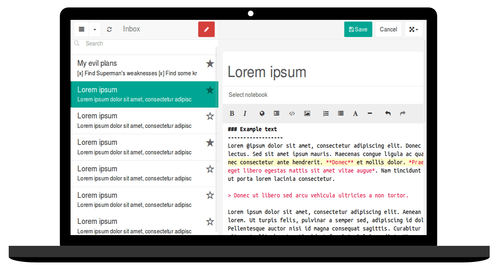

# Laverna for YunoHost

[](https://dash.yunohost.org/appci/app/laverna)    
[](https://install-app.yunohost.org/?app=laverna)

*[Read this readme in english.](./README.md)* 

> *Ce package vous permet d'installer Laverna rapidement et simplement sur un serveur YunoHost.  
Si vous n'avez pas YunoHost, consultez [le guide](https://yunohost.org/#/install) pour apprendre comment l'installer.*

## Overview
Laverna is an anonymous system, encrypted and without registration required, it is accessible via a web browser (without software installation).
The data is private because it is stored by default on your machine (InnoDB and localstorage), it is a setting in the settings that will allow you to synchronize it via the cloud on your various devices.

**Shipped version:** 0.7.51

## Screenshots



## Demo

* [Official demo](https://laverna.cc/app/)

## Configuration

How to configure this app: From an admin panel, a plain file with SSH, or any other way.

## Documentation

 * Official documentation: Link to the official documentation of this app
 * YunoHost documentation: If specific documentation is needed, feel free to contribute.

## YunoHost specific features

#### Multi-user support

 * Are LDAP and HTTP auth supported? **No**
 * Can the app be used by multiple users? **Yes**

#### Supported architectures

* x86-64 - [](https://ci-apps.yunohost.org/ci/apps/laverna/)
* ARMv8-A - [](https://ci-apps-arm.yunohost.org/ci/apps/laverna/)

## Limitations

* Any known limitations.

## Additional information

* Other info you would like to add about this app.

## Links

 * Report a bug: https://github.com/YunoHost-Apps/laverna_ynh/issues
 * App website: https://laverna.cc/index.html
 * Upstream app repository: https://github.com/Laverna/laverna
 * YunoHost website: https://yunohost.org/

---

## Developer info

Please send your pull request to the [testing branch](https://github.com/YunoHost-Apps/laverna_ynh/tree/testing).

To try the testing branch, please proceed like that.
```
sudo yunohost app install https://github.com/YunoHost-Apps/laverna_ynh/tree/testing --debug
or
sudo yunohost app upgrade laverna -u https://github.com/YunoHost-Apps/laverna_ynh/tree/testing --debug
```
